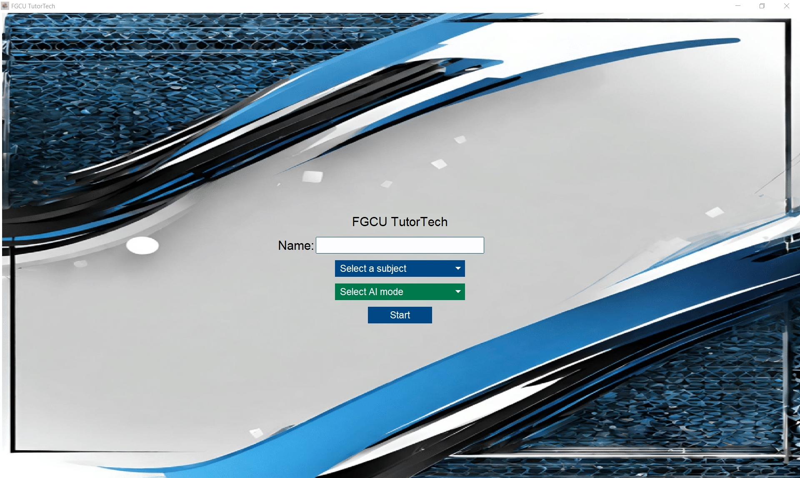

# FGCU-Tutoring-Training-AI
### Team Members: Zachary Sutton, Mikayla Ries
The project is a desktop application designed to support the training of tutors at Florida Gulf Coast University. 
Leveraging OpenAI's API Assistants, the application fine-tunes the base GPT-3.5-Turbo model to simulate interactions between tutors and tutees. 
It offers three distinct modes: Tutee, Tutor, and Generate Conversation. 
Users can roleplay as either a tutee or a tutor, and generate simulated conversations between the two roles. 
The application aims to provide training for both new and experienced tutors, offering practice opportunities and enhancing the overall training process.

## Start Frame:

## Conversation Frame:
